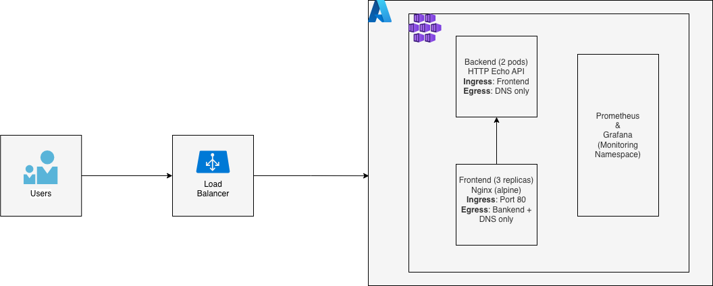
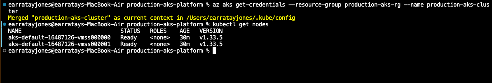
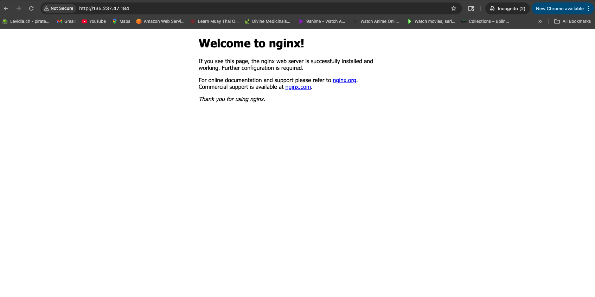
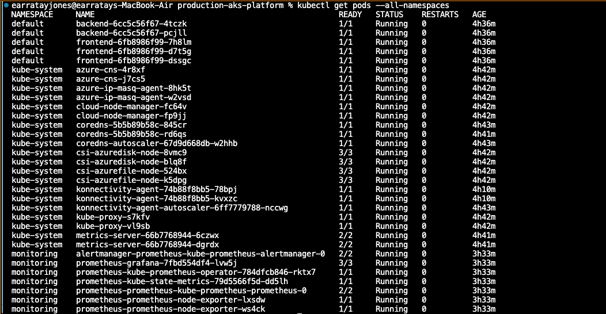
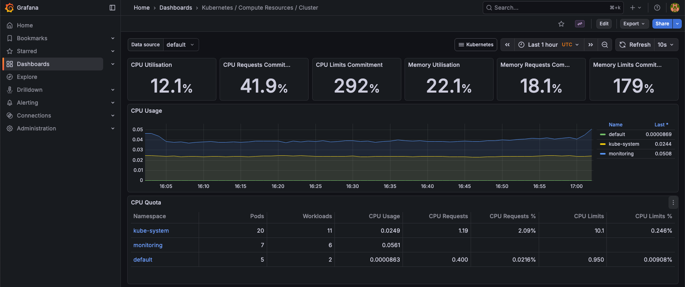
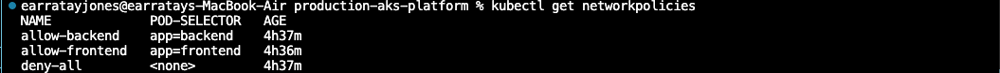
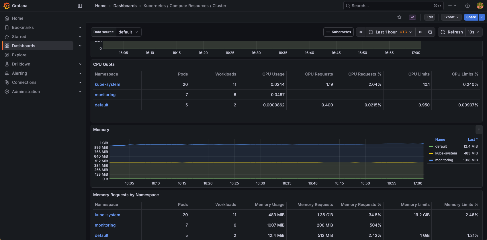

# Production Ready AKS Platform

A production-grade Azure Kubernetes Service cluster demonstrating modern DevOps practices, infrastructure as code, and cloud-native architecture.


## Project Overview

This project showcases a complete Kubernetes platform on Azure with:
- Infrastructure as Code using Terraform
- Multi-tier application architecture
- Prometheus & Grafana monitoring
- Production-ready security and resource management

## Architecture



## Screenshots

### Deployed Infrastructure

The cluster is fully operational with 2 worker nodes:



### Multi-Tier Application

Frontend nginx application accessible via Azure LoadBalancer:



All pods running across namespaces:



### Monitoring Stack

Comprehensive cluster observability with Grafana dashboards:



### Security Implementation

Network policies enforcing traffic segmentation:



## Components

**Infrastructure:**
- Azure Kubernetes Service (AKS)
- 2-node cluster (Standard_D2s_v3)
- System-assigned managed identity
- Azure Load Balancer

**Applications:**
- Frontend: Nginx (3 replicas, internet-facing)
- Backend: HTTP API (2 replicas, internal only)

**Security**

- **Network Policies:** Default deny-all with explicit allow rules
- **Resource Quotas:** Namespace-level resource limits
- **Managed Identity:** Azure-managed credentials (no service principals)
- **RBAC:** Role-based access control enabled
- **Network Isolation:** Backend not exposed to internet

[View security documentation](docs/security.md)

**Monitoring:**
- Prometheus (metrics collection)
- Grafana (dashboards & visualization)

[Detailed Architecture](docs/architecture.md)

## Technologies

| Category | Technology |
|----------|------------|
| **Cloud Platform** | Microsoft Azure |
| **Container Orchestration** | Kubernetes (AKS) |
| **Infrastructure as Code** | Terraform |
| **Monitoring** | Prometheus, Grafana |
| **Package Management** | Helm |
| **Version Control** | Git, GitHub |

## Quick Start

### Prerequisites
- [Azure CLI](https://docs.microsoft.com/en-us/cli/azure/install-azure-cli)
- [Terraform](https://www.terraform.io/downloads.html) (>= 1.0)
- [kubectl](https://kubernetes.io/docs/tasks/tools/)
- [Helm](https://helm.sh/docs/intro/install/)

### Deploy
```bash
# Clone repository
git clone https://github.com/terrythomas00/production-aks-platform.git
cd production-aks-platform

# Login to Azure
az login

# Deploy infrastructure
terraform init
terraform apply

# Configure kubectl
az aks get-credentials --resource-group aks-production-rg --name production-aks-cluster

# Deploy applications
kubectl apply -f kubernetes/apps/

# Install monitoring
helm repo add prometheus-community https://prometheus-community.github.io/helm-charts
kubectl create namespace monitoring
helm install prometheus prometheus-community/kube-prometheus-stack -n monitoring

# Verify
./scripts/check-cluster.sh
```

[Full Deployment Guide](docs/deployment-guide.md)

## Monitoring

Access Grafana dashboards:
```bash
kubectl port-forward -n monitoring svc/prometheus-grafana 3000:80
```
```bash
# Get the Grafana admin password from the secret
kubectl get secret -n monitoring prometheus-grafana -o jsonpath="{.data.admin-password}" | base64 --decode ; echo
```

Open http://localhost:3000 (admin/password)




[Monitoring Documentation](docs/monitoring.md)

## Cost

**Estimated monthly cost:** ~$165
- Compute (2 nodes): ~$140
- Load Balancer: ~$20
- Storage: ~$5


## Documentation

- [Architecture Overview](docs/architecture.md)
- [Deployment Guide](docs/deployment-guide.md)
- [Monitoring Setup](docs/monitoring.md)

## Learning Outcomes

This project demonstrates:

**Infrastructure as Code**
- Terraform for cloud resource provisioning
- Declarative infrastructure management
- Version-controlled infrastructure

**Container Orchestration**
- Kubernetes cluster management
- Multi-tier application deployment
- Service discovery and load balancing

**Observability**
- Metrics collection with Prometheus
- Visualization with Grafana
- Production-ready monitoring

**Cloud Security**
- Managed identities
- Network isolation
- Resource limits and quotas

**DevOps Practices**
- GitOps workflows
- Documentation as code
- Automation scripts

## Cleanup

To delete all resources:
```bash
./scripts/cleanup.sh
```

Or manually:
```bash
terraform destroy
```

## 👤 Author

**Terry Thomas**  
DevOps Engineer | Cloud Infrastructure | Azure Certified (AZ-104) | Security + |

- 📧 Email: terry.thomas00@gmail.com
- 💼 LinkedIn: [www.linkedin.com/in/terry-thomas-a2081b131]
- 🐙 GitHub: [@terrythomas00](https://github.com/terrythomas00)

## 📄 License

MIT License - see [LICENSE](LICENSE) file for details:

---
